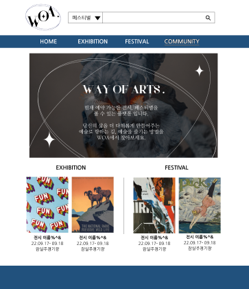
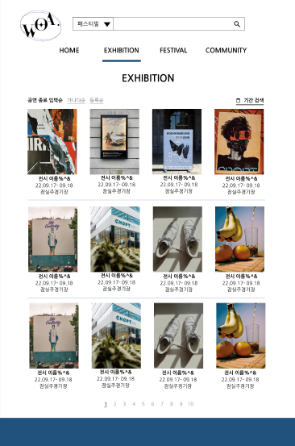

# 멋쟁이사자처럼 중앙해커톤 (2022y)

---

# 🎪 WOA - Way Of Art

"전국 전시·축제를 한 눈에!"  
**WOA**는 전국의 문화행사를 한눈에 확인하고 쉽게 탐색할 수 있도록 돕는 웹 서비스입니다.

---

## 🔧 사용 기술

- **Frontend**: HTML, CSS, JavaScript, Bootstrap
- **Backend**: Django
- **협업 툴**: Figma, GitHub, Notion

---

## 🚀 주요 기능

- 인터파크, 위메프 등 여러 플랫폼에 산재되어 있는 각종 전시 및 페스티벌들의 정보를 하나의 서비스에서 접근하기 쉽게 전달해줍니다.

---

## 📷 주요 화면

| 메인 페이지 | 전시 크롤링 페이지 |
|-----------|-----------|
|  |  | 

---

## 👩‍💻 담당 역할

- Festivals, Exhibitions 메인 페이지 및 상세 페이지 구현
- Django 템플릿 문법을 활용해 서버 데이터를 동적으로 렌더링

---

## 📝 회고

> 프론트엔드로 역할을 수행하면서도 디장고 템플릿 언어등을 통해 백엔드와의 연결을 배울 수 있었습니다!
> 백엔드의 크롤링 데이터를 받아 처리해보며 이전과는 다른 많은 양의 데이터를 다뤄 볼 수 있는 좋은 경험이었습니다! 

